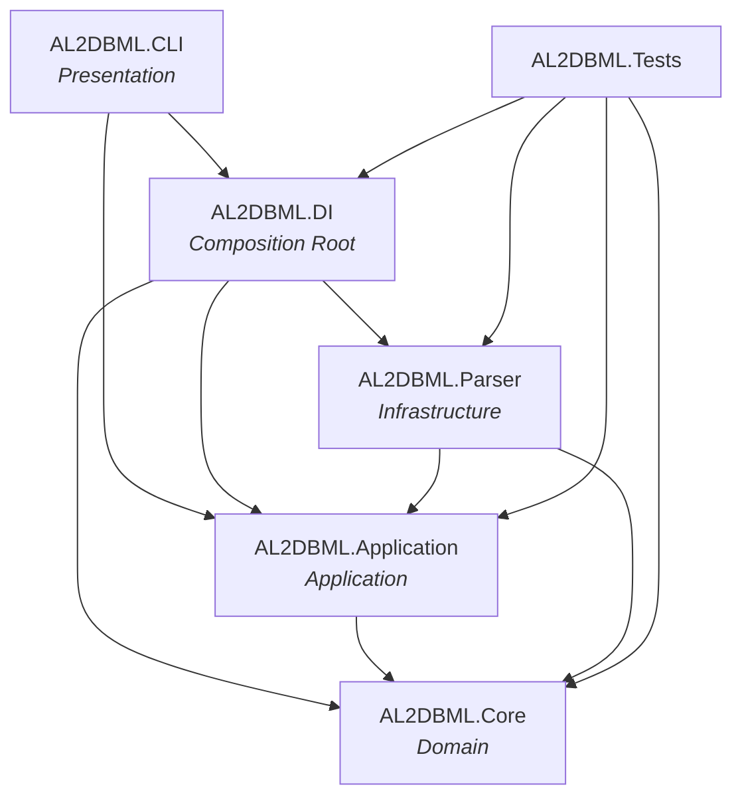
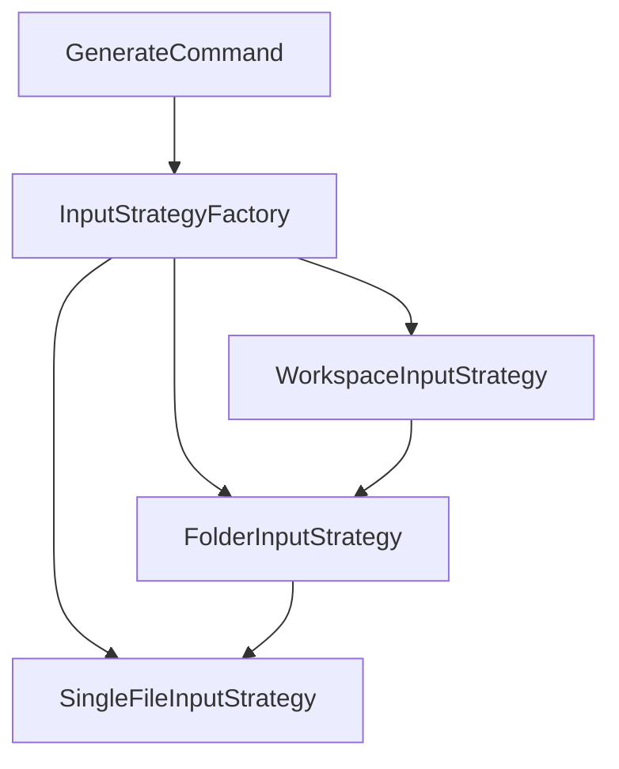

# Architecture

AL2DBML follows a Clean Architecture pattern: the CLI resolves dependencies through a dedicated Composition Root, while the Parser acts as infrastructure implementing contracts defined by the Application layer — keeping the Domain model free of any external dependency.

## Dependency graph

## CLI layer

The CLI is built on **Spectre.Console.Cli** and exposes two commands:

| Command | Description |
|---|---|
| `generate` | Parses AL input and writes a `.dbml` file |
| `init` | Initializes the `.al2dbml/` config directory interactively |

### Input strategy pattern

`generate` delegates input handling to an `IInputStrategy` resolved by `InputStrategyFactory` based on the detected input type:

| Strategy | Input | Behaviour |
|---|---|---|
| `SingleFileInputStrategy` | `.al` file | Detects file type, calls the appropriate parser method |
| `FolderInputStrategy` | Directory | Scans for `*.al` recursively, delegates each file to `SingleFileInputStrategy` |
| `WorkspaceInputStrategy` | `.code-workspace` | Reads workspace JSON, resolves each folder path, delegates to `FolderInputStrategy` |

Files with an unsupported type (`AlFileType.Unknown`) are silently skipped — this is intentional since AL projects contain many non-table/enum objects.

### Configuration

`init` creates a `.al2dbml/` directory at the project root with two files:

| File | Tracked | Content |
|---|---|---|
| `config.json` | versioned | output path and file name (shared across contributors) |
| `config.local.json` | gitignored | input path (contributor-specific, especially for workspaces) |

`generate` reads these files if present; CLI arguments always take precedence.

### Services

| Service | Scope | Responsibility |
|---|---|---|
| `FileSystemService` | static | Input type detection, directory scan |
| `ConfigService` | scoped | Read/write `.al2dbml/` config files |
| `ParsingTracker` | scoped | Track file count and elapsed time per command execution |

### DI integration

Spectre.Console.Cli is integrated with `Microsoft.Extensions.DependencyInjection` via a custom `TypeRegistrar`/`TypeResolver`. A new DI scope is created per command execution so scoped services (parser state, tracker) are properly isolated.
