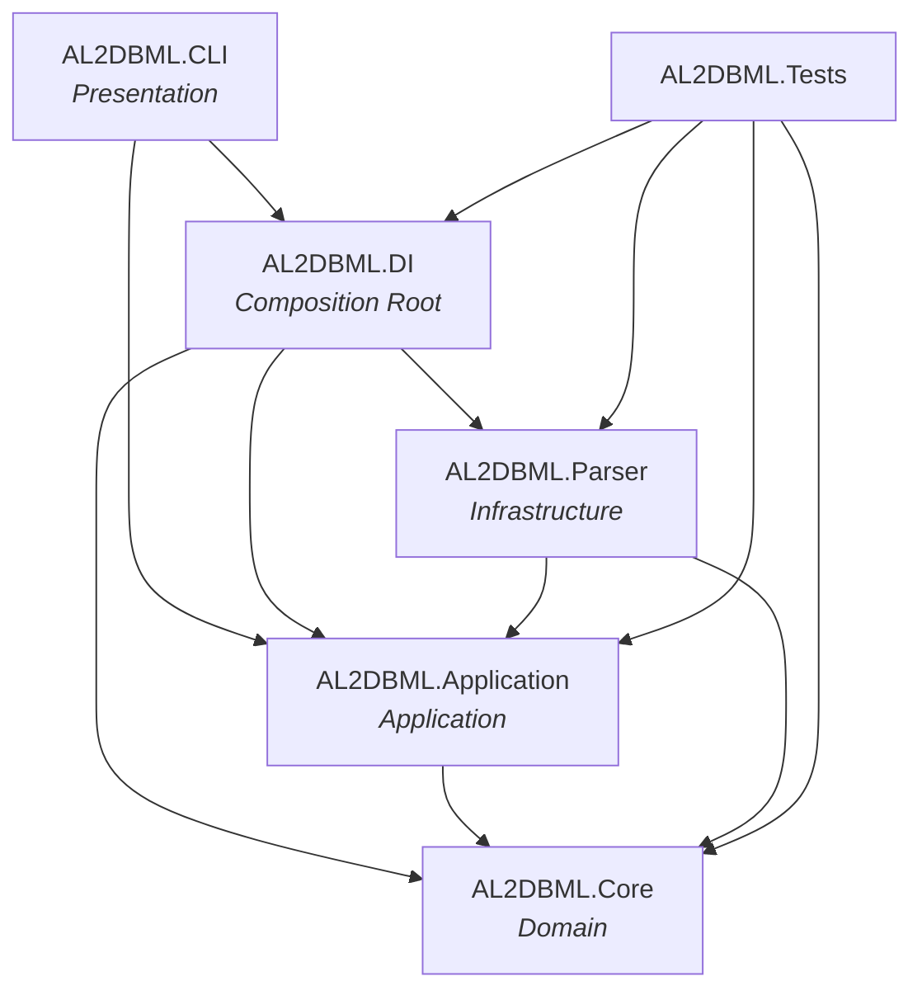

# Architecture

AL2DBML follows a Clean Architecture pattern: the CLI resolves dependencies through a dedicated Composition Root, while the Parser acts as infrastructure implementing contracts defined by the Application layer — keeping the Domain model free of any external dependency.

